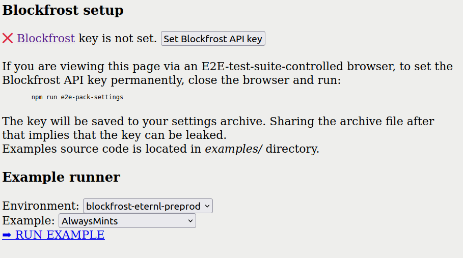

# E2E Testing in the Browser

CTL comes with advanced machinery for E2E testing in the browser, which can be used to either run the included examples (in `examples`) or create a custom test suite for E2E testing.

**Table of Contents**

<!-- START doctoc generated TOC please keep comment here to allow auto update -->
<!-- DON'T EDIT THIS SECTION, INSTEAD RE-RUN doctoc TO UPDATE -->

- [Parts Involved](#parts-involved)
- [User perspective](#user-perspective)
- [How to Run the Included Examples](#how-to-run-the-included-examples)
- [How Wallets are Used](#how-wallets-are-used)
  - [Where to Find the Installed Extensions](#where-to-find-the-installed-extensions)
  - [How to Use a Different User Wallet](#how-to-use-a-different-user-wallet)
- [Using a reproducible `chromium` version](#using-a-reproducible-chromium-version)
- [Configuring E2E test suite](#configuring-e2e-test-suite)
- [Creating a custom test suite](#creating-a-custom-test-suite)
  - [How to configure the wallet](#how-to-configure-the-wallet)
  - [Re-Packing an Extension as a CRX File](#re-packing-an-extension-as-a-crx-file)
  - [Getting the extension ID](#getting-the-extension-id)
  - [Using custom unauthorized extensions](#using-custom-unauthorized-extensions)
  - [Serving the Contract to be tested](#serving-the-contract-to-be-tested)
  - [Mocking CIP-30 interface](#mocking-cip-30-interface)
  - [Using CIP-30 mock with Plutip](#using-cip-30-mock-with-plutip)

<!-- END doctoc generated TOC please keep comment here to allow auto update -->

## Parts Involved

[Puppeteer](https://github.com/puppeteer/puppeteer) (driven by [Toppokki](https://github.com/justinwoo/purescript-toppokki))
is used to drive the tests. Supported browsers are [Chromium](https://www.chromium.org/) and Google Chrome.
The browser can be run headless (default) or headful (useful during test development).

Any `Contract` that should be tested must be deployed and running on some testserver (e.g. for the included examples we use `npm run e2e-test`). The test suite accepts a list of URLs.

The test suite requires a set of CRX (chrome extension) files, as well as an archive with user settings. Extension and wallet settings can optionally be configured to be fetched from a URL.

Each extension should be provided with its extension ID and wallet password.

For a working example see `test/E2E.purs`. It can be run conveniently using `npm run e2e-test`.

## User perspective

- Use `npm run e2e-serve` to [serve](#serving-the-contract-to-be-tested) the examples for testing.
- Use `npm run e2e-test` to run the test suite in headless mode or `npm run e2e-test-debug` to enable the browser UI.
- Use `npm run e2e-browser` to open the browser window with extensions pre-loaded. If you modify any setting (e.g. set a collateral), it's important to run `npm run e2e-pack-settings` **without running anything in between**. The test suite resets the settings by loading them from the settings archive before each test run.
- To [pack and unpack](#how-wallets-are-used) extension settings to or from the archive file `npm run e2e-pack-settings` and `npm run e2e-unpack-settings` scripts should be used, respectively.

## How to Run the Included Examples

The process is as follows:

1. run `npm run e2e-serve` in Nix shell (enter `nix develop`)
2. run `npm run start-runtime` in another shell (can be outside of `nix develop` shell)
3. run `npm run e2e-test` in second Nix shell (enter `nix develop`)

## How Wallets are Used

For purposes of testing, there are two parts to using a wallet: providing the right software version and importing a wallet with enough tAda and a known password.

- The software just needs to be unpacked to some directory. This can either be the location where the browser unpacks it, or the result of unpacking a CRX file (see below).
- We provide the wallet data as a single tarball which will be unpacked into the chrome profile before a test run (`test-data/settings.tar.gz`)

### Where to Find the Installed Extensions

1. Locate your browser profile directory. Commonly used locations include: `~/.config/{google-chrome,chromium}/Default` (where `Default` is the profile name), `~/snap/chromium/common/chromium/Default`.
2. Make sure that inside the profile, your desired extension is unpacked. Nami should be in `Extensions/lpfcbjknijpeeillifnkikgncikgfhdo`, Gero (testnet version) in `Extensions/iifeegfcfhlhhnilhfoeihllenamcfgc`.
3. Add the version as a subdirectory, too. The final path may look like `/home/user/.config/google-chrome/Default/Extensions/iifeegfcfhlhhnilhfoeihllenamcfgc/1.10.9_0`

### How to Use a Different User Wallet

In the test suite, the wallet settings are just unpacked using `tar`.

A new settings tarball can be easily created:

1. Run the browser with `npm run e2e-browser`
2. Set up a wallet extension, create and fund the wallet, and set the collateral.
3. Close the browser.
4. Run `npm run e2e-pack-settings`. The file located at `test-data/settings.tar.gz` will be updated.

## Using a reproducible `chromium` version

Although most users will have some version of Chromium or Google Chrome installed system-wide, it can be a good idea to use the same version for all e2e testing. When creating your project's `devShell` using `purescriptProject`, you can set the `shell.withChromium` flag to `true` to include it in the shell's packages. This will be the version of `chromium` present in the `nixpkgs` you pass to create your project:

```nix
{
  projectFor = system:
    let
      pkgs = nixpkgsFor system;
    in
    pkgs.purescriptProject {
      inherit pkgs;
      projectName = "my-project";
      shell = {
        withChromium = true;
        # ...
      };
      # ...
    };
}
```

## Configuring E2E test suite

The tests can set up using CLI arguments, environment variables, or both. CLI arguments have higher priority.

| Parameter                                                              | CLI argument                | Environment variable       |
|------------------------------------------------------------------------|-----------------------------|----------------------------|
| Temporary directory                                                    | `--tmp-dir`                 | `E2E_TMPDIR`               |
| Test specs (`wallet:url` format)                                       | `--test` (multiple allowed) | `E2E_TESTS`                |
| Test timeout                                                           | `--test-timeout`            | `E2E_TEST_TIMEOUT`         |
| Browser binary path or name                                            | `--browser`                 | `E2E_BROWSER`              |
| Don't use headless mode                                                | `--no-headless`             | `E2E_NO_HEADLESS`          |
| Path to the user settings archive                                      | `--settings-archive`        | `E2E_SETTINGS_ARCHIVE`     |
| URL of settings archive asset                                          | `--settings-archive-url`    | `E2E_SETTINGS_ARCHIVE_URL` |
| Path to the user data directory                                        | `--chrome-user-data`        | `E2E_CHROME_USER_DATA`     |
| Extra browser CLI arguments                                            | `--extra-browser-args`      | `E2E_EXTRA_BROWSER_ARGS`   |
|------------------------------------------------------------------------|-----------------------------|----------------------------|
| Eternl CRX URL                                                         | `--eternl-crx-url`          | `ETERNL_CRX_URL`           |
| Eternl CRX file                                                        | `--eternl-crx`              | `ETERNL_CRX`               |
| Eternl password                                                        | `--eternl-password`         | `ETERNL_PASSWORD`          |
| Eternl Extension ID                                                    | `--eternl-extid`            | `ETERNL_EXTID`             |
| Lode CRX URL                                                           | `--lode-crx-url`            | `LODE_CRX_URL`             |
| Lode password                                                          | `--lode-password`           | `LODE_PASSWORD`            |
| Lode Extension ID                                                      | `--lode-extid`              | `LODE_EXTID`               |
| Nami CRX URL                                                           | `--nami-crx-url`            | `NAMI_CRX_URL`             |
| Nami CRX file                                                          | `--nami-crx`                | `NAMI_CRX`                 |
| Nami password                                                          | `--nami-password`           | `NAMI_PASSWORD`            |
| Nami Extension ID                                                      | `--nami-extid`              | `NAMI_EXTID`               |
| Flint CRX URL                                                          | `--flint-crx-url`           | `FLINT_CRX_URL`            |
| Flint CRX file                                                         | `--flint-crx`               | `FLINT_CRX`                |
| Flint password                                                         | `--flint-password`          | `FLINT_PASSWORD`           |
| Flint Extension ID                                                     | `--flint-extid`             | `FLINT_EXTID`              |
| Gero CRX URL                                                           | `--gero-crx-url`            | `GERO_CRX_URL`             |
| Gero CRX file                                                          | `--gero-crx`                | `GERO_CRX`                 |
| Gero password                                                          | `--gero-password`           | `GERO_PASSWORD`            |
| Gero Extension ID                                                      | `--gero-extid`              | `GERO_EXTID`               |
|------------------------------------------------------------------------|-----------------------------|----------------------------|
| E2E+Plutip: Plutip port number                                         | `--plutip-port`             | `PLUTIP_PORT`              |
| E2E+Plutip: Ogmios port number                                         | `--ogmios-port`             | `OGMIOS_PORT`              |
| E2E+Plutip: Kupo port                                                  | `--kupo-port`               | `KUPO_PORT`                |

The default configuration can be found in `test/e2e.env`.

## Creating a custom test suite

In order to test your own application while using CTL as a library, some extra steps need to be performed.

### How to configure the wallet

Since E2E tests are executed on one of the public testnets, some setup is needed to allow spending funds from the testnet.

1. Run `npm run e2e-browser`.
2. Install the needed extension
3. Click through the wallet setup interface, use the [testnet faucet](https://docs.cardano.org/cardano-testnet/tools/faucet) to fund your address, and set the collateral.
4. Now, **without running the browser again**, execute `npm run e2e-pack-settings`.

As a result, you will get a settings archive with the wallet in a particular state.

### Re-Packing an Extension as a CRX File

While some wallets, like Eternl, provide a single extension that works with `preprod`, `preview` and `mainnet`, others (e.g. Lode) are distributed separately for each of the testnets.

If you need to use `preprod` instead of `preview`, perform the following steps to get the `.crx` file:

1. Make sure your browser is using the desired extension version.
2. Navigate to chrome://extensions/
3. Click the extension.
4. Switch on "Developer mode" (upper right corner).
5. Click "Pack extension".
6. Paste the extension's directory (see above) into "Extension root directory". You can leave "Private key file" empty.
7. Click "Pack extension".
8. The path of the CRX file is displayed in the browser.

### Getting the extension ID

After packing the extension, the test suite must be provided with its ID.

1. Open list of extensions in the browser settings
2. Enable Developer Mode (top-right corner)
3. The IDs will become visible

### Using custom unauthorized extensions

However, the approach above only works for extensions installed directly from Chrome Web Store.

If an extension is not published on Chrome Web Store (e.g. it's a custom or private build), it may not have a stable ID. Look into `manifest.json` `key` property to check - if it is not present, the ID will change on each reload, which makes automation impossible.

To freeze the ID, first unpack the `.crx` archive, load the extension unpacked (in developer mode), and then pack it back. It will give you a new `.crx` as well as a `.pem` file with the same name. The ID can now be derived from this key using this command:

```bash
openssl rsa -in key.pem -pubout -outform DER | openssl base64 -A
```

Unarchive the CRX, put the encoded public key to `key` property of `manifest.json` file, and archive the directory back. You can then reopen the browser and the ID will remain the same.

[More on extension IDS](https://stackoverflow.com/questions/37317779/making-a-unique-extension-id-and-key-for-chrome-extension)

### Serving the Contract to be tested

The test suite accepts URLs, which means that the `Contract` you want to test must be served.

It's up to the user how to set up the web server (see `make run-dev` for an example), but in order for the testing engine to "see" the contract, the configuration parameters must be changed:

```purescript
runContract config { hooks = Contract.Test.E2E.e2eFeedbackHooks } do
  ...
```

Hooks are a special feature that allows to run arbitrary code during various stages of `Contract` execution. `e2eFeedbackHooks` notify the engine of wallet actions that can be triggered while the `Contract` is running, for example, when an extension pop-up appears. The testing engine can react to that by issuing commands to interact with the wallet UI, e.g. to enter the password and click "sign".

Note that the test closes successfully after the first successful `Contract` execution, so if your scenario involves multiple `Contract`s, remove `onSuccess` hooks from every `Contract` except the last one, or manually run `e2eFeedbackHooks.onSuccess` (it's just an `Effect` action).

CTL offers a function to serve the `Contract`s to be tested with a router, that dispatches contracts and configuration parameters based on query part of the URL.

It also builds a page with drop-downs, allowing to select an example and an environments, that looks like this:



See [this file](../templates/ctl-scaffold/test/E2E.purs) for a quick example:

```purescript
main :: Effect Unit
main = do
  -- Adds links to all available tests to the DOM for convenience
  addLinks configs tests
  -- Serves the appropriate `Contract` with e2eTestHooks
  route configs tests

configs :: Map E2EConfigName (ContractParams /\ Maybe WalletMock)
configs = Map.fromFoldable
  [ "nami" /\ testnetNamiConfig /\ Nothing
  , "gero" /\ testnetGeroConfig /\ Nothing
  , "flint" /\ testnetFlintConfig /\ Nothing
  , "eternl" /\ testnetEternlConfig /\ Nothing
  , "lode" /\ testnetLodeConfig /\ Nothing
  , "nami-mock" /\ testnetNamiConfig /\ Just MockNami
  , "gero-mock" /\ testnetGeroConfig /\ Just MockGero
  , "flint-mock" /\ testnetFlintConfig /\ Just MockFlint
  , "lode-mock" /\ testnetLodeConfig /\ Just MockLode
  ]

tests :: Map E2ETestName (Contract Unit)
tests = Map.fromFoldable
  [ "Contract" /\ Scaffold.contract
  -- Add more `Contract`s here
  ]
```

Now, the `Scaffold.contract` can be used as a test:

```bash
E2E_TESTS="
nami:http://localhost:4008/?nami:Contract
"
```

The `nami:` prefix specifies which browser extension to load for the test, and the query parameter is for the router to be able to find the appropriate config.

Refer to the docs for `Contract.Test.E2E.route` function for an overview of the URL structure.

### Mocking CIP-30 interface

It is possible to test the contracts without having a single wallet extension installed, just by providing a private payment key, and (optionally) a private stake key, that correspond to a testnet address with some tAda. CTL test suite can mock (partially) the functionality of a CIP-30 wallet given just the keys.

Note that different wallets implement different *application logic* despite using a uniform interface, for example, Eternl uses multiple addresses, while all the other wallets are single-address. For now, CIP-30 mock implements single-address logic only. There is no guarantee that the logic that is implemented by the mock is the same as one of a real wallet: subtle differences or bugs can affect the execution path of your application.

To provide the keys, they first need to be generated.

Follow this guide to generate key pairs:

https://developers.cardano.org/docs/stake-pool-course/handbook/keys-addresses/

As a result, you will get json files that look like this:

```json
{
  "type": "PaymentSigningKeyShelley_ed25519",
  "description": "Payment Signing Key",
  "cborHex": "58200b07c066ba037344acee5431e6df41f6034bf1c5ffd6f803751e356807c6a209"
}
```

Simply copy the `cborHex` from payment and stake signing keys (the order is important), and add them to the URL, separating by `:`:

```
http://localhost:4008/?nami-mock:Contract:58200b07c066ba037344acee5431e6df41f6034bf1c5ffd6f803751e356807c6a209:5820f0db841df6c7fbc4506c58fad6676db0354a02dfd26efca445715a8adeabc338
```

The `nami:` prefix should not be specified, otherwise CTL will refuse to overwrite the existing wallet with a mock.

In order to use the keys, their corresponding address must be pre-funded using the [faucet](https://docs.cardano.org/cardano-testnet/tools/faucet) (beware of IP-based rate-limiting) or from another wallet. Most contracts require at least two UTxOs to run (one will be used as collateral), so it's best to make two transactions.

### Using CIP-30 mock with Plutip

It's possible to run headless browser tests on top of a temporary plutip cluster. In this case, key generation and pre-funding will be handled by `plutip-server`, as well as deployment of all the query layer services.

To do that, it's enough to define a config name that:

- uses a `ContractParams` value with `networkId` set to `MainnetId`.
- Specifies a wallet mock (e.g. `MockNami`)

E.g.:

```purescript
wallets :: Map E2EConfigName (ContractParams /\ Maybe WalletMock)
wallets = Map.fromFoldable
  [ "plutip-nami-mock" /\ mainnetNamiConfig /\ Just MockNami
  , "plutip-gero-mock" /\ mainnetGeroConfig /\ Just MockGero
  , "plutip-flint-mock" /\ mainnetFlintConfig /\ Just MockFlint
  , "plutip-lode-mock" /\ mainnetLodeConfig /\ Just MockLode
  ]
```

Then a test entry *without* specifying any private key can be used:

```bash
export E2E_TESTS="
plutip:http://localhost:4008/?plutip-nami-mock:SomeContract
"
```

Full example can be found [in the template](../templates/ctl-scaffold/test/E2E.purs).

There are a few important caveats/limitations:

- We only allow base addresses (with a stake pubkey hash present) to be used. If there's a need to use enterprise addresses, the users should move some ada to their own enterprise address, e.g. with `mustPayToPubKey`
- The amount of tAda is fixed to `1000000000000` and divided into 5 UTxOs equally
