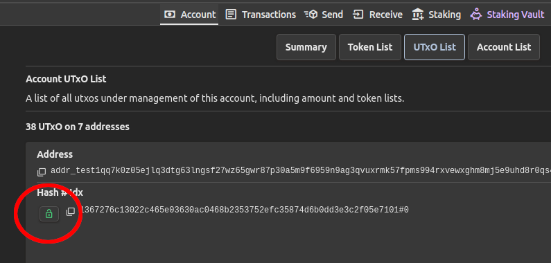

<!-- START doctoc generated TOC please keep comment here to allow auto update -->
<!-- DON'T EDIT THIS SECTION, INSTEAD RE-RUN doctoc TO UPDATE -->

- [CTL Query Layers](#ctl-query-layers)
  - [Wallet/Backend Inconsistency](#walletbackend-inconsistency)
    - [Configuring synchronization behavior](#configuring-synchronization-behavior)
    - [Synchronization and wallet UTxO locking](#synchronization-and-wallet-utxo-locking)
    - [Historical notes](#historical-notes)
  - [See also](#see-also)

<!-- END doctoc generated TOC please keep comment here to allow auto update -->

# CTL Query Layers

On Cardano, every running node has its own opinion on the set of currently unspent transaction outputs. Only [eventual consistency](https://en.wikipedia.org/wiki/Eventual_consistency) is guaranteed.

A *Query Layer* is a software that provides an API to interact with underlying cardano-node(s).

In CTL context, the following query layers can be used, depending on backend choice:

- [Ogmios](https://ogmios.dev/) ([CTL backend](./runtime.md#ctl-backend))
- [Kupo](https://cardanosolutions.github.io/kupo/) ([CTL backend](./runtime.md#ctl-backend))
- [Blockfrost](https://blockfrost.io/) ([Blockfrost backend](./blockfrost.md))
- [CIP-30 light wallet browser extensions](https://cips.cardano.org/cip/CIP-0030) (any backend)

## Wallet/Backend Inconsistency

Any dApp that interacts with a CIP-30 wallet has to deal with the inconsistency between local `cardano-node`-based query layer and light wallet query layer, especially when dApp workflow involves sending multiple interactions with the wallet in quick succession.

Thus, the goal of the developers is to ensure that the set of UTxOs available to the wallet and the set of UTxOs the backend cardano-node knows about are *synchronized enough* to not cause errors when wallet or backend operations are performed. To give a few examples of potential issues, consider the following scenarios:

- A dApp tries to balance a transaction with UTxOs from the wallet that are not yet available in Ogmios or Blockfrost, causing an error response
- A transaction is passed for signing, but the wallet does not yet know about the UTxOs it spends, and thus refuses to sign it (this happens with Eternl)
- A transaction is sent to the network via Ogmios or Blockfrost and is confirmed there, but the wallet still does not know about its UTxOs.

CTL tries to be smart when dealing with the issue, and it aims to let the user work with both query layers as if it was one. To achieve this guarantee, CTL follows three simple rules:

- **Rule 1** Whenever there is a *wallet operation* the result of which depends on the set of available UTxOs, CTL delays the execution until it reaches a state where *all wallet UTxOs are known to the backend*. These operations are assumed to be `getWalletUtxos`, `getWalletCollateral` and `getWalletBalance`.
- **Rule 2** Whenever there is a transaction *`signTx`* [CIP-30](https://cips.cardano.org/cip/CIP-0030/) call, the execution is delayed until all transaction inputs that come from one of the addresses controlled by the wallet *are known to the wallet*.
- **Rule 3** Whenever CTL is asked to await for *transaction confirmation*, the execution is delayed until the *UTxOs that the transaction creates at wallet addresses* are visible to the wallet.

The rules are implemented as 3 callable functions, which we call *synchronization primitives*:

1. `Contract.Sync.syncBackendWithWallet :: Contract Unit` - wait for wallet UTxOs to appear on backend
2. `Contract.Sync.syncWalletWithTxInputs :: Array TransactionInput -> Contract Unit` - wait for inputs to appear in the wallet
3. `Contract.Sync.syncWalletWithTransaction :: TransactionHash -> Contract Unit` - wait for Tx outputs to appear in the wallet

The developer does not have to call them manually, because by default all the synchronization primitives are enabled when CIP-30 wallets are used.

### Configuring synchronization behavior

Although stronger UTxO set consistency guarantees allow to develop more reliable applications in less time, some users may find the delays or remote call overhead not worth it.

To give some examples, it may be known that:

- wallet UTxOs did not change in a while
- all the UTxOs a new transaction uses have long been settled in the wallet
- that the UTxOs a transaction creates at the wallet addresses will not be consumed again

To account for these cases, synchronization primitives can be configured or disabled via `synchronizationParams` field of `ContractParams`:

```purescript
type ContractSynchronizationParams =
  { syncBackendWithWallet ::
      { errorOnTimeout :: Boolean
      , beforeCip30Methods :: Boolean
      , beforeBalancing :: Boolean
      }
  , syncWalletWithTxInputs ::
      { errorOnTimeout :: Boolean, beforeCip30Sign :: Boolean }
  , syncWalletWithTransaction ::
      { errorOnTimeout :: Boolean, beforeTxConfirmed :: Boolean }
  }
```

- `before*` boolean value fields allow to enable or disable the delays (see above for correspondence between synchronization rules and function names).
- `errorOnTimeout` field controls whether a given synchronization primitive should throw an exception when timeouts are reached, or just print a warning to the console. It is set to `false` by default, use `Contract.Config.strictSynchronizationParams` to throw.
- Use `Contract.Config.disabledSynchronizationParams` to disable synchronization completely (this brings back CTL pre-v5.1.0 behavior). Additionally, `Contract.Sync.withoutSync` helper function can be used to disable synchronization locally in `Contract` context.

The timeouts themselves can be configured using `timeParams` field of `ContractParams`:

```purescript
type ContractTimeParams =
  { ...
  , syncWallet :: { delay :: Milliseconds, timeout :: Seconds }
  , syncBackend :: { delay :: Milliseconds, timeout :: Seconds }
  }
```

`delay` fields control intervals between synchronization checks.

Note that it is possible to set `timeout` to `Seconds infinity`.

### Synchronization and wallet UTxO locking

`Contract.Utxos.utxosAt` function returns a set of UTxOs at a given address by calling Kupo or Blockfrost, depending on the backend. It seems reasonable to assume that if we call `utxosAt` at all wallet's addresses we will get the same set of UTxOs that [CIP-30](https://cips.cardano.org/cip/CIP-0030/) `getUtxos` method would return (eventually). But it is not, in fact, true.

*UTxO locking* is a wallet feature that allows to hide certain UTxOs from results of CIP-30 calls, making them invisible to dApps. Among the wallets we support, it is currently only present in Eternl:



UTxO locking does not play well with `syncWalletWithTxInputs` and `syncWalletWithTransaction`, because the set of UTxOs these functions poll for may contain locked UTxOs, and thus the synchronization can fail by timeout (either with an exception or a console warning, see `errorOnTimeout` configuration parameter above).

However, the developer can easily safeguard against this problem by following one simple rule:

- `utxosAt` should not be used to get UTxOs present on wallet's addresses. Instead, `Contract.Wallet.getWalletUtxos` should be used.

`utxosAt` will log a warning to the console when used with a wallet's address.

### Historical notes

Initially we underestimated the problem of UTxO set inconsistency between query layers and decided to just use our backend as a source of truth all the time, because sticking to CIP-30 just wouldn't be enough for our needs. This decision led to subtle and non-reproducible problems in our clients dApps, so we wouldn't suggest anyone to follow this path.

Conceptually, the wallet is responsible for *owning* the UTxOs, so wallet developers may implement behaviors that would prevent us from making general assumptions about the wallet state.

CTL `v5.1.0` introduces better consistency guarantees while not requiring the developer to change any code on their side - for the price of slight delays during the app runtime.

## See also

- [Optimising your app with custom query layers](./custom-query-layers.md)
